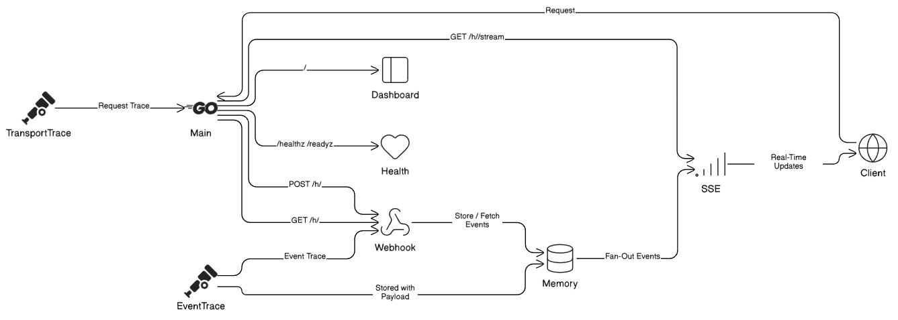
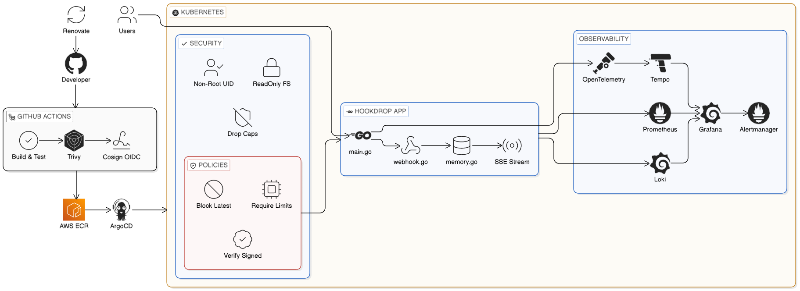

<div align="center">

# HookDrop

</div>
POST events into named buckets. Inspect them live over SSE. Ships with a full Kubernetes delivery stack — Helm, ArgoCD, Kyverno, and an OpenTelemetry observability pipeline.

---
## Overview
 
HookDrop captures incoming webhooks and makes them inspectable in real time.
 
POST to a named bucket — the event lands in memory with its full headers, body, source IP, and a per-event trace ID. GET the bucket to list events. Subscribe to `/stream` and you get a live SSE feed as new webhooks arrive.
 
The app itself is small. The repo is also a working reference for how to wire a Go service into a production-style delivery stack: image signing with Cosign, admission enforcement with Kyverno, GitOps sync via ArgoCD, and distributed tracing through OpenTelemetry → Tempo.
 
---

## Features
 
**Webhook capture**
- `POST /h/<bucket>` — store a webhook event with full headers, body, and source IP
- `GET /h/<bucket>` — list stored events (latest 50 per bucket, in memory)
- `GET /h/<bucket>/stream` — live SSE stream; events pushed as they arrive

**Tracing and health**
- Every request gets a trace ID — picks up `X-Trace-Id` if provided, generates one otherwise
- Two trace IDs in play: a transport-level trace per request, and a separate per-event trace ID stored in the payload
- OTel spans emitted per request when `OTEL_EXPORTER_OTLP_ENDPOINT` is set
- `/healthz` and `/readyz` for liveness and readiness probes

**Platform hardening**
- Resource limits, HPA, ServiceMonitor, and PrometheusRule in the Helm chart
- Service account token auto-mount disabled
- NetworkPolicy scoped to app and ArgoCD namespaces with OTLP egress only
- Kyverno admission policy requiring a valid Cosign signature before pods are admitted
---
 

## Stack

| Layer | Tools |
|---|---|
| Backend | Go, `net/http`, Zerolog |
| Telemetry | OpenTelemetry, OTLP gRPC exporter |
| Container | Docker, distroless runtime image |
| Kubernetes | Helm, kind, ArgoCD, Kyverno, NetworkPolicy, HPA |
| Observability | Prometheus, Grafana, Loki, Tempo, OTel Collector |
| Supply Chain | Trivy, Cosign, Renovate |

---

## Architecture

### Request path



Two trace IDs are in play: the middleware creates a transport-level trace per request; the webhook handler generates a separate per-event trace ID that goes into the stored payload and response. They're related, but not the same value.

### CI/CD pipeline



From code push to running pod:

1. Push or PR to `main` triggers `ci.yml` — builds the binary, runs `go test -race`, gates on `golangci-lint`
2. Trivy scans the container image and Helm chart for CVEs
3. On merge, CI builds the multi-stage Docker image (Alpine builder → distroless runtime) and pushes to ECR tagged by commit SHA
4. Cosign signs the image keylessly against Sigstore immediately after push
5. **Gap (not yet automated):** `reusable-build.yml` can commit the updated image tag back into `helm/hookdrop/values.yaml` and push to the deploy branch, which would close the GitOps loop. Tag promotion is currently manual.
6. ArgoCD watches the deploy branch, detects the updated Helm values, and syncs the `hookdrop` namespace automatically
7. Kyverno admission webhook verifies the Cosign signature before the pod is admitted — unsigned images are rejected at the cluster boundary
8. Pod starts; OTel collector receives traces over gRPC and forwards to Tempo

## Kubernetes and GitOps
 
### Cluster Bootstrap

- `setup-cluster.sh` provisions the local Kubernetes environment using Kind, installs ArgoCD for GitOps deployments, applies Kyverno admission policies, and synchronizes the HookDrop application into the `hookdrop` namespace.

### Observability Stack

- `setup-observability.sh` deploys the monitoring and tracing stack, including Prometheus, Grafana, Alertmanager, Loki, Tempo, and the OpenTelemetry Collector. Application telemetry is exported over OTLP (4317/4318) and forwarded to Tempo for distributed tracing.

> `values-local.yaml` for local, `values-prod.yaml` for prod (different registry, ingress config).
 

---


## Quick Start

**Prerequisites:** Go, Docker, kind, kubectl, Helm

```bash
git clone https://github.com/nirjxr26/HookDrop.git
cd HookDrop
```

### Option 1 — Local Go

```bash
make dev          # run on :8080
make build
make test
make lint
make scan
```

### Option 2 — Docker (Recommended)

```bash
make docker-build
make docker-run
```

### Option 3 — Kubernetes (kind)

```bash
make cluster-up
make observability-up
make docker-build

kind load docker-image hookdrop:local --name hookdrop
kubectl apply -f k8s/argocd/application.yaml
kubectl get pods -n hookdrop -w
```

**Port-forward cluster UIs:**
 
```bash
kubectl port-forward svc/argocd-server -n argocd 8081:443

kubectl port-forward -n observability svc/kube-prometheus-stack-grafana 3000:80
kubectl port-forward -n observability svc/kube-prometheus-stack-prometheus 9090:9090
kubectl port-forward -n observability svc/kube-prometheus-stack-alertmanager 9093:9093
```

**Verify the app:**

```bash
kubectl port-forward svc/hookdrop-hookdrop -n hookdrop 8080:80

curl -X POST http://localhost:8080/h/test \
  -H "Content-Type: application/json" \
  -d '{"hello":"world"}'

curl http://localhost:8080/h/test
curl http://localhost:8080/h/test/stream
```

---

## API

| Method | Path | Description |
|---|---|---|
| `POST` | `/h/<bucket>` | Store a webhook event (headers + body + source IP) |
| `GET` | `/h/<bucket>` | List stored events (latest 50, in memory) |
| `GET` | `/h/<bucket>/stream` | Live SSE stream; events pushed as they arrive |
| `GET` | `/healthz` | Liveness probe |
| `GET` | `/readyz` | Readiness probe |
| `GET` | `/` | Route listing |

Every request gets a trace ID. The middleware picks up `X-Trace-Id` if provided, otherwise generates one. If `OTEL_EXPORTER_OTLP_ENDPOINT` is set, OTel spans are emitted per request.

---

## Configuration

| Variable | Default | Description |
|---|---|---|
| `PORT` | `8080` | HTTP server port |
| `LOG_LEVEL` | `info` | Zerolog log level |
| `OTEL_SERVICE_NAME` | `hookdrop` | Service name in traces |
| `OTEL_EXPORTER_OTLP_ENDPOINT` | — | OTLP gRPC endpoint; tracing is a no-op if unset |

---

## Project Structure
```
├── main.go                       # server entrypoint
├── telemetry.go                  # tracing setup
├── handler/
│   ├── webhook.go                # event endpoints
│   ├── health.go                 # health checks
│   └── dashboard.go              # home page
├── store/
│   └── memory.go                 # event storage
├── helm/hookdrop/                # Helm chart
├── k8s/
│   ├── argocd/                   # GitOps config
│   ├── kyverno/                  # security policies
│   └── observability/            # monitoring configs
├── scripts/
│   ├── setup-cluster.sh          # cluster bootstrap
│   └── setup-observability.sh    # monitoring setup
├── Dockerfile                    # container build
├── docker-compose.yml            # local stack
└── kind-config.yaml              # Kind cluster config
```

---

## Limitations

- Events are stored in memory. A pod restart clears everything.
- SSE connections send periodic keepalive comments to survive proxies and load balancers that close idle connections.
- The GitOps loop isn't fully closed — image tag promotion to the deploy branch is currently manual (see pipeline step 5 above).