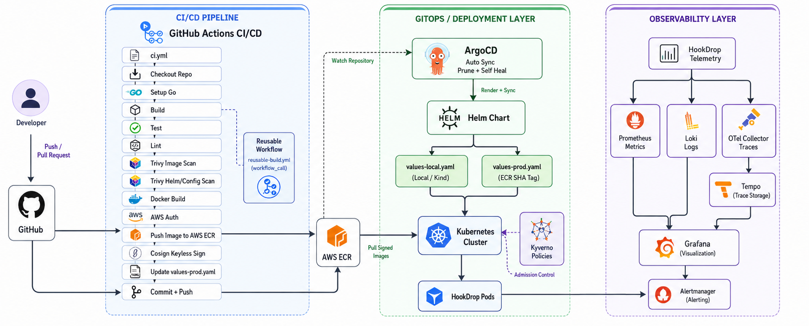

<div align="center">

<h1>HookDrop</h1>

<p>A self-hosted webhook receiver with in-memory event buckets, live SSE streaming, health probes, and a production-style Kubernetes delivery stack.</p>
</div>

## Overview

HookDrop is a lightweight Go service for capturing and replaying webhooks locally or inside Kubernetes. It stores events in memory by bucket, exposes a live Server-Sent Events stream for each bucket, and ships with readiness and liveness endpoints for platform integration.

Around the app, the repository includes Helm charts, kind bootstrap scripts, ArgoCD sync, Kyverno policies, and observability wiring for Prometheus, Grafana, Loki, Tempo, and OpenTelemetry.

## Tech Stack

- **Backend:** Go, `net/http`, Zerolog
- **Telemetry:** OpenTelemetry, OTLP gRPC exporter
- **Storage:** In-memory event store
- **Containerization:** Docker, Distroless runtime image
- **Kubernetes:** Helm, kind, ArgoCD, Kyverno, NetworkPolicy, HPA, ServiceMonitor, PrometheusRule
- **Observability:** Prometheus, Grafana, Loki, Tempo, OTel Collector
- **Supply Chain:** Trivy, Cosign, Renovate

## Features

### Webhook Capture & Replay
- POST webhooks into named buckets with `POST /h/<bucket-id>`.
- List captured events with `GET /h/<bucket-id>`.
- Stream live events with `GET /h/<bucket-id>/stream` using SSE.
- Keep the latest 50 events per bucket in memory.

### Health & Tracing
- Exposes `/healthz` and `/readyz` for probes and rollout gates.
- Adds a request trace ID to every request, using `X-Trace-Id` when provided.
- Emits OpenTelemetry spans for each HTTP request.

### Platform Hardening
- Helm chart with resource requests and limits, HPA, ServiceMonitor, and PrometheusRule.
- Service account token auto-mounting disabled.
- NetworkPolicy and Kyverno policies for safer cluster admission.
- GitOps-friendly ArgoCD application manifests.

### Delivery & Maintenance
- Local dev, build, test, lint, and scan targets in `Makefile`.
- Kind bootstrap for local clusters and observability.
- Renovate configuration for dependency updates.

## CI/CD Architecture
<div align="center">

</div>


**Pipeline overview:**
- Pushes and pull requests run build, test, lint, and security scans.
- Container images are built and published for deployment.
- Helm values are updated for the deployed image tag.
- ArgoCD syncs the cluster from Git.
- Prometheus scrapes app metrics and the OTel Collector forwards traces to Tempo.

Full platform entrypoints:
- [Helm chart](./helm/hookdrop/Chart.yaml)
- [ArgoCD application](./k8s/argocd/application.yaml)
- [OpenTelemetry collector config](./k8s/observability/otel-collector-config.yaml)
- [Kyverno signature policy](./k8s/kyverno/verify-cosign-signature.yaml)

---

## Quick Start

### Prerequisites

Clone the repo first:

```bash
git clone https://github.com/nirjxr26/HookDrop.git
cd HookDrop
```

## Option 1 - Local Go Development

Requires Go, Docker, kind, kubectl, and Helm if you want the Kubernetes stack.

```bash
make dev
```

Useful commands:

```bash
make build
make test
make lint
make scan
```

The app listens on `:8080` by default.

## Option 2 - Docker

Build the image and run it locally:

```bash
make docker-build
make docker-run
```

## Option 3 - Kubernetes with kind

```bash
make cluster-up
make observability-up
make docker-build
kind load docker-image hookdrop:local --name hookdrop
kubectl apply -f k8s/argocd/application.yaml
kubectl get pods -n hookdrop -w
```

The service is exposed through the Helm release in the `hookdrop` namespace.

### Access the cluster UIs

```bash
# ArgoCD
kubectl port-forward svc/argocd-server -n argocd 8081:443

# Grafana
kubectl port-forward -n observability svc/kube-prometheus-stack-grafana 3000:80

# Prometheus
kubectl port-forward -n observability svc/kube-prometheus-stack-prometheus 9090:9090

# Alertmanager
kubectl port-forward -n observability svc/kube-prometheus-stack-alertmanager 9093:9093
```

### Verify the app

```bash
kubectl port-forward svc/hookdrop-hookdrop -n hookdrop 8080:80
curl -X POST http://localhost:8080/h/test -H "Content-Type: application/json" -d '{"hello":"world"}'
curl http://localhost:8080/h/test
curl http://localhost:8080/h/test/stream
```

## Environment Variables

The application reads the following variables:

```env
PORT=8080
LOG_LEVEL=info
OTEL_SERVICE_NAME=hookdrop
OTEL_EXPORTER_OTLP_ENDPOINT=otel-collector.observability.svc.cluster.local:4317
```

## Project Structure

```text
├── main.go                # HTTP server, routing, graceful shutdown
├── telemetry.go           # OpenTelemetry bootstrap and request spans
├── handler/               # Health, dashboard, and webhook handlers
├── store/                 # In-memory bucket store and pub/sub fanout
├── helm/hookdrop/         # Helm chart for deployment and monitoring
├── k8s/                   # ArgoCD, Kyverno, and observability manifests
├── scripts/               # Cluster and observability bootstrap scripts
├── Dockerfile             # Multi-stage build with distroless runtime
├── docker-compose.yml     # Local container workflow
└── kind-config.yaml       # Local kind cluster configuration
```

## Documentation

| Topic | Link |
|---|---|
| Helm chart | [helm/hookdrop/Chart.yaml](./helm/hookdrop/Chart.yaml) |
| ArgoCD app | [k8s/argocd/application.yaml](./k8s/argocd/application.yaml) |
| OTel collector | [k8s/observability/otel-collector-config.yaml](./k8s/observability/otel-collector-config.yaml) |
| Kyverno policies | [k8s/kyverno/](./k8s/kyverno/) |
| Cluster setup | [scripts/setup-cluster.sh](./scripts/setup-cluster.sh) |
| Observability setup | [scripts/setup-observability.sh](./scripts/setup-observability.sh) |

## Notes

- Event storage is in memory, so captured webhook data is ephemeral.
- The SSE stream keeps connections open and sends keepalive comments periodically.
- The dashboard at `/` is a simple built-in status page, not a separate frontend app.
